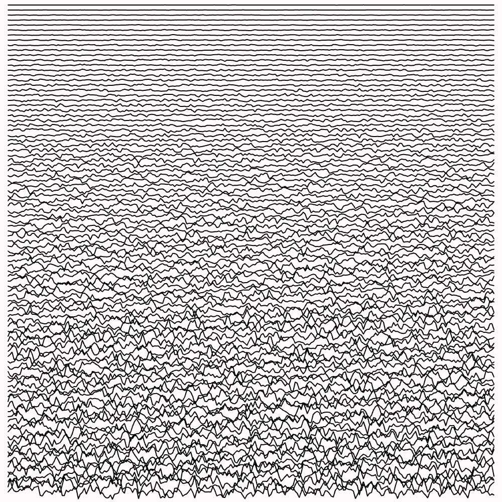

# @lokua/p5

Exploratory sketches made with p5.js

Stuff like this:




You can see more here on github by looking at the auto generated
[markdown index](index.md)

## Run

```sh
npm start
```

Then navigate to http://localhost:3000 in browser

## Development

> IMPORTANT! This project uses Git LFS

A copy of ffmpeg must be available on your PATH if you plan on recording
animations.

To get OSX to STFU about ffmpeg permissions run:

```sh
xattr -dr com.apple.quarantine /usr/local/bin/ffmpeg
```

To create a new sketch, copy one of the existing ones from the
[src/sketches](src/sketches) folder or start from scratch with
[src/sketches/template.mjs](src/sketches/template.mjs). All sketches in this
folder are available to load in the UI

## Learning Resources

Resources I'm using to guide myself:

- https://genekogan.com/code/p5js-transformations/
