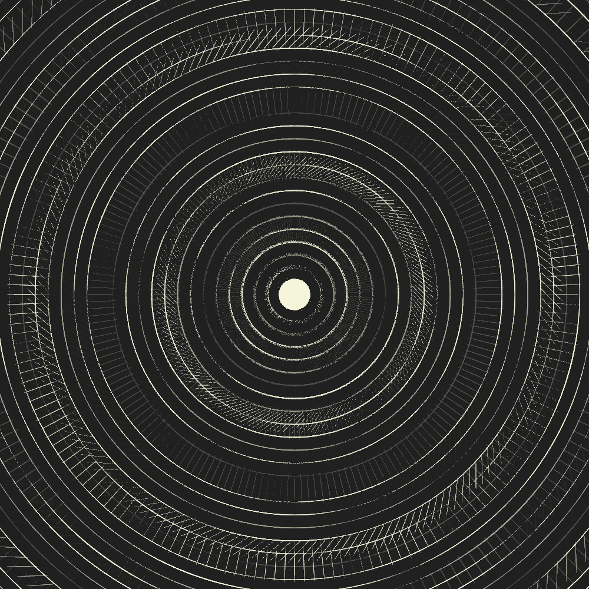

# @lokua/p5

Exploratory sketches made with p5.js

Stuff like this:





You can see more here on github by looking at the auto generated
[markdown index](index.md)

## Run

```sh
npm start
```

Then navigate to http://localhost:3000 in browser

## Development

> IMPORTANT! This project uses Git LFS so I think you would need that installed?
> Not sure this is my first time using it 🤷🏻‍♂️

A copy of ffmpeg must be available on your PATH if you plan on recording
animations.

To get OSX to shut up about ffmpeg permissions on MacOS run:

```sh
xattr -dr com.apple.quarantine /usr/local/bin/ffmpeg
```

To create a new sketch, copy one of the existing ones from the
[src/sketches](src/sketches) folder or start from scratch with
[src/sketches/template.mjs](src/sketches/template.mjs). All sketches in this
folder are available to load in the UI

## Learning Resources & Cool Stuff

- [Nature Of Code](https://natureofcode.com/)
- [The Creative Code Page](https://available-anaconda-10d.notion.site/That-Creative-Code-Page-c5550ef2f7574126bdc77b09ed76651b)
- [The Recode Project](http://recodeproject.com/)
- [Easings.net](https://easings.net)
- [Simulating Watercolor](https://www.tylerxhobbs.com/words/a-guide-to-simulating-watercolor-paint-with-generative-art)
- [Open Processing](https://openprocessing.org/)
- [P5js Transformations](https://genekogan.com/code/p5js-transformations/)
- [Julien Leonard Tutorials](https://julienleonard.com/tutorials.html)
- [palmdrop](https://palmdrop.github.io/)
- [Inigo Quilez ](https://iquilezles.org/articles/warp/)

### Marbling

- [The Coding Train: Coding Challenge 183: Paper Marbling Algorithm](https://www.youtube.com/watch?v=p7IGZTjC008&t=613s)
- [Dropping Paint](https://people.csail.mit.edu/jaffer/Marbling/Dropping-Paint)
- [Digital Marbling](https://blog.amandaghassaei.com/2022/10/25/digital-marbling/)
