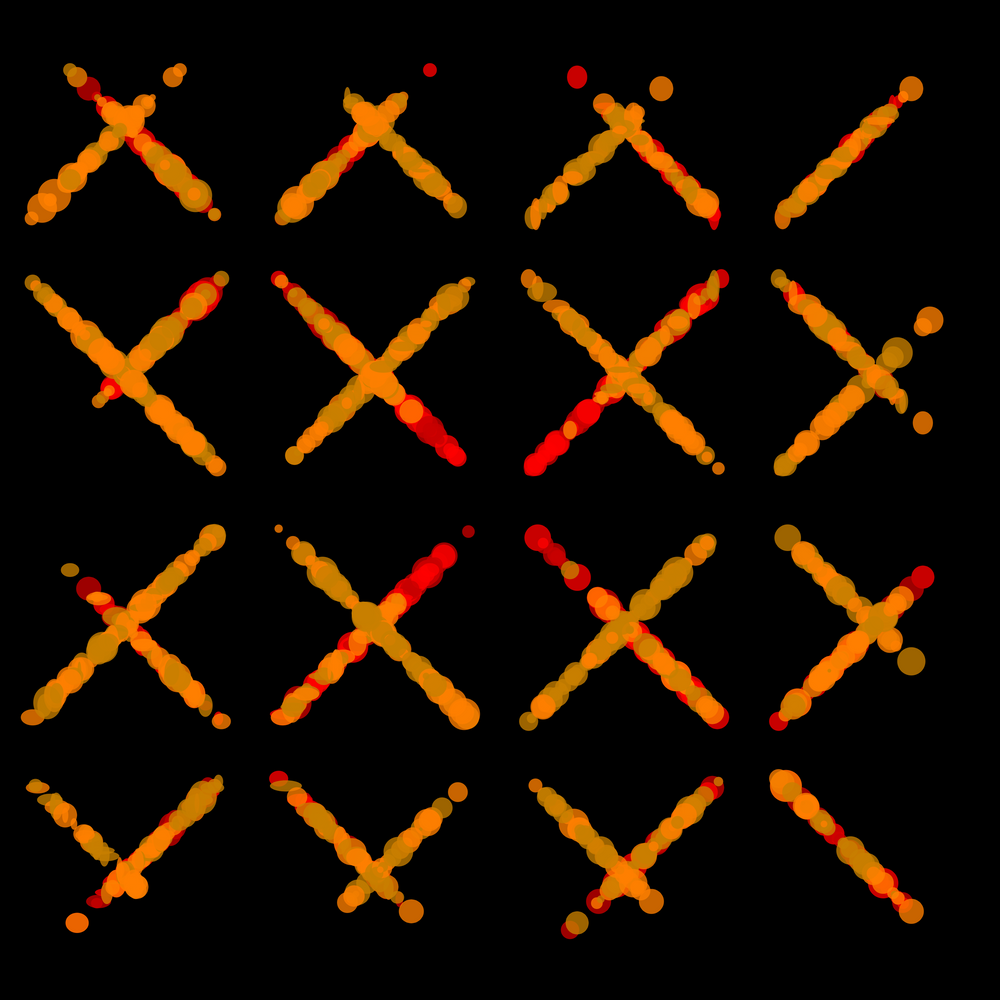
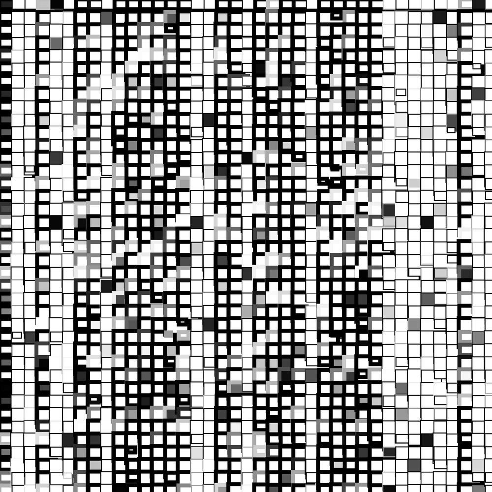

## burst-140m.png

## burst-3dd57.png

## burst-58n6e.png

## burst-7emz.png

## burst-994eg.png

## burst-mo1yz.png

## burst-muzdi.png

## burst-nrp0.png

## burst-p3iu4.png

## burst2-0495u.png

## burst2-0ghq7.png

## burst2-4vfse.png

## burst2-596xg.png

## burst2-o6qa.png

## burst2-sgs1j.png

## burst2-zn4w.png

## burst3-01a34.png

## burst3-01v6.png

## burst3-12o66.png

## burst3-1f6o.png

## burst3-1sjf7.png

## burst3-2nvlh.png

## burst3-2oy2.png

## burst3-4895f.png

## burst3-4j63p.png

## burst3-53kzu.png

## burst3-558iw.png

## burst3-572u3.png

## burst3-6bb6q.png

## burst3-7of.png

## burst3-8tv38.png

## burst3-90xa.png

## burst3-a2623.png

## burst3-a334q.png

## burst3-b9f39.png

## burst3-ey2.png

## burst3-h7.png

## burst3-ki37w.png

## burst3-mmpaw.png

## burst3-n0hcq.png

## burst3-q7q7.png

## burst3-t4n4m.png

## burst3-t874y.png

## burst3-ttl9.png

## burst3-v68s6.png

## burst3-w5h14.png

## burst3-yo7xc.png

## grid3-1v3cb--median=17.png

## grid3-1v3cb.png

## grid3-dyo99.png

## grid4-ppi2.png

## grid4-u2m4.png

## grid5-i31hj.png

## grid5-rhc13.png

## sin2-363vo.png

## sin2-725fb.png

## sn2-363vo.png
